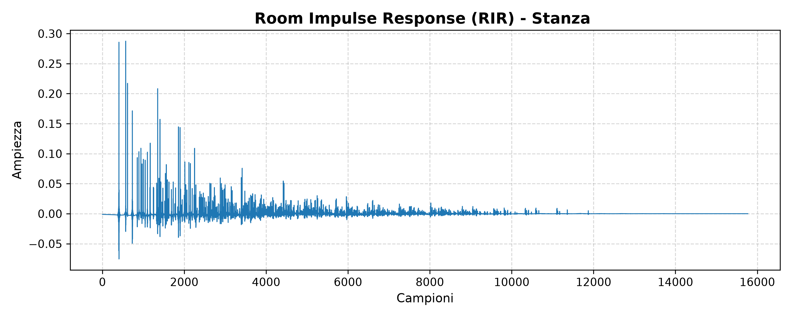

# Binaural Auralization (Outdoor & Indoor)

A Python-based framework for 3D spatial audio rendering, designed to simulate both outdoor dynamic events (e.g., microscopic vehicle pass-by) and indoor architectural acoustics. 

This project leverages **HRTF (Head-Related Transfer Functions)** via the SOFA standard and **Hybrid Room Acoustics** (Image-Source Method + Ray Tracing) to generate highly realistic, perceptually accurate binaural audio for soundscape evaluation and acoustic research.

## Features
- **Outdoor Pass-by Simulation:** Dynamic 3D trajectory mapping of a moving point source, including $1/r$ geometric attenuation.
- **Indoor Architectural Acoustics:** Shoebox room modeling with frequency-dependent material absorption coefficients.
- **Hybrid Binaural Rendering:** Seamless integration of directional HRIR spatialization with calculated Room Impulse Responses (BRIR synthesis).
- **Overlap-Add Convolution:** Efficient block-based signal processing for moving sources in real-time length.

## Repository Structure
The project is modular, allowing for isolated testing of spatial and architectural parameters:

* `buss_core.py`: Simulates a dynamic outdoor pass-by event (e.g., a single vehicle traversing the listening point).
* `buss_indoor.py`: Generates the RIR (Room Impulse Response) of a custom shoebox room based on material absorption.
* `buss_3d_room.py`: Combines SOFA HRTF spatialization (static source) with the computed room reverberation.
* `buss_dynamic_room.py`: The complete hybrid engine. A moving sound source traverses a defined 3D trajectory within a reverberant room, combining dynamic HRTF convolution with the architectural RIR.

## Prerequisites & Installation
This project requires Python 3.x and the following scientific libraries:

```bash
pip install -r requirements.txt
```

*(Main dependencies: `numpy`, `scipy`, `soundfile`, `pysofaconventions`, `pyroomacoustics`)*

### Datasets Required (can be found in the Media folder):

1. **SOFA File:** A valid HRTF dataset (e.g., `FABIAN_HRIR_measured_HATO_0.sofa` from TU Berlin).
2. **Dry Audio:** Anechoic or completely dry mono `.wav` files (e.g., `traffic_dry.wav`, `voce_dry.wav`).

## Methodology
The spatialization engine calculates the instantaneous Euclidean distance and azimuth for a moving source. The signal is framed and convolved with the nearest measured HRIR from the SOFA dataset. For indoor environments, `pyroomacoustics` simulates the early reflections and late reverberation tail based on specified surface properties, which is then convolved with the HRTF-processed direct sound.

## Audio Demos

### Outdoor Auralization
Dynamic simulation of a vehicle pass-by in a free field (using `buss_core.py`).
- [🔊 Original Mono Source: Traffic](Media/traffic_dry.wav)
- [🎧 3D Auralization: Dynamic Pass-by](Media/traffic_passby_dynamic.wav)

### Indoor Architectural Auralization
Hybrid simulation combining SOFA spatialization and Shoebox room reverberation.
- [🔊 Original Mono Source: Voice](Media/voce_dry.wav)
- [🎧 **Stage 1:** Room Reverberation Only](Media/indoor_auralization.wav) — Basic acoustic imprint (using `buss_indoor.py`).
- [🎧 **Stage 2:** Static 3D Position + Room](Media/voce_binaurale_stanza.wav) — Source placed statically to the front-left of the listener (using `buss_3d_room.py`).
- [🎧 **Stage 3:** Dynamic Moving Source + Room](Media/voce_dinamica_stanza.wav) — Source traversing the reverberant room in real-time (using `buss_dynamic_room.py`).


## Acoustic Analysis (RIR)
